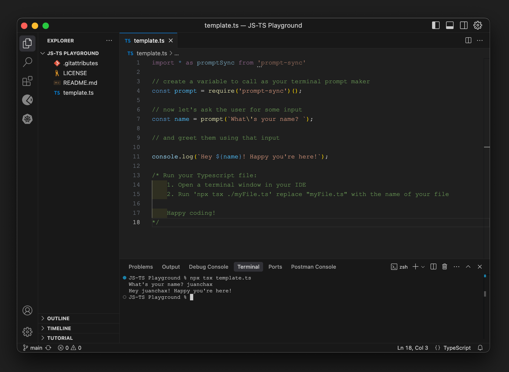

# JS-TS-Playground

Simple template project to create and run JS and TS files, ask for user input (in the terminal window) and use the input as a variable in your code



This is intended for learning purposes, so that when getting started with Javascript and Typescript, folks are not forced to take on the *huge* task of learning, building, and impllementing a web UI as well.

The project makes use of:

- [`tsx`](https://discordapp.com/channels/1329366022423183372/1346413632166039552/1347984628891258941) to run ts files without the need of compiling it before (as in: `tsc main.ts && node main.js`).
- [`prompt-sync`](https://github.com/heapwolf/prompt-sync#readme) to prompt users for input in a terminal window.

## Installation & Usage

To use this project, follow these steps:

- NodeJS should be installed. Find instructions on how to install it [here](https://nodejs.org/en/download/) for your operation system.
- Open VSCode and clone this repository to your local machine using either VSCode built in source control functionality or open the terminal pane and use the command `git clone https://github.com/juanchax/JS-TS-Playground.git`.
- Navigate to the project directory using `cd js-ts-vanilla-playground`.
- Run `node -v` to check if NodeJS is installed correctly.
- run `npm install` to install all dependencies (`tsx` and `prompt-sync`).

Now you should be ready to start coding! You can read the instructions in the `tempalte.ts` file or follow these here:

1. Open a terminal window in your IDE
2. copy the template.ts to the src folder and rename it to 'myfile.ts'
3. Edit your file as you like
4. Run 'npx tsx ./src/myFile.ts' replace "myFile.ts" with the name of your file

And now: Happy coding!

## Background Information

For everyone who is not already a developer   (i.e.  coming from dev/coding/scripting), I strongly suggest you start with a vanilla everything.

yeah, extensions, pre-built playgrounds, pre-built anythings are nice, but they will not help you learn.  If you got to Flavio's Bootcamp to learn how to think programmatically, and build actual code, app, program, then this is for you.

Learning means failing over and over and keeping at it until you figure it out--with help and tips from the crowd or not-- otherwise what you're teaching yourself is.. zilch.

So, getting a cool extension (I loooove WallabyJS' products btw) will actually keep you from the actual learning.

If you don't know how to write, run, debug, build your code manually--the brain learns by repetition  , which is why auto-complete "helps" to write fast but your brain will not learn the actual thing it's doing-- it'll be harder to become a developer.

You learned the multiplication table waaay before you used a calculator.  Be mindful of your goal. Embrace the hardship.

### tldr

Don't ask mommy bird to chew your food for you , just learn a fast easy way to run your code, and you'll be set for life.

Easy peasy for Typescript: [tsx](https://tsx.is/getting-started)

Given a Typescript file index.tx you can run the file in your terminal like so:

```typescript
npx tsx ./index.ts
```
