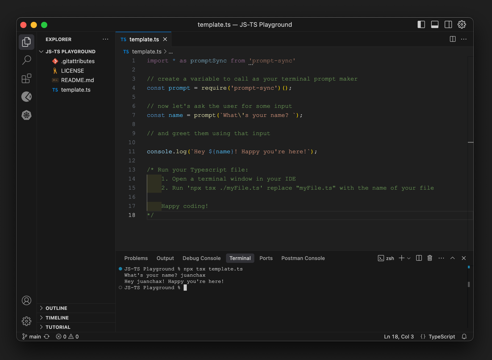

# JS-TS-Playground

 Simple template project to create and run JS and TS files, ask for user input (in the terminal window) and use the input as a variable in your code

 

  This is intended for learning purposes, so that when getting started with Javascript and Typescript, folks are not forced to take on the *huge* task of learning, building, and impllementing a web UI as well.

 The project makes use of:

- [`tsx`](https://discordapp.com/channels/1329366022423183372/1346413632166039552/1347984628891258941) to run ts files without the need of compiling it before (as in: `tsc main.ts && node main.js`).
- [`prompt-sync`](https://github.com/heapwolf/prompt-sync#readme) to prompt users for input in a terminal window.

## Hapy Coding
