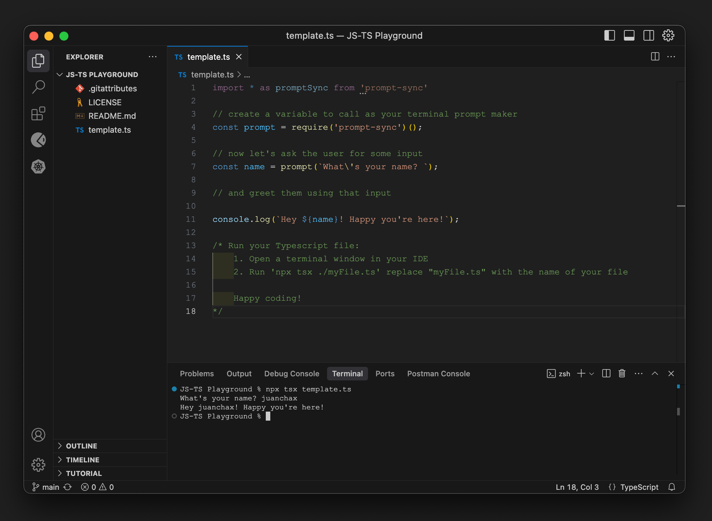

# JS-TS-Playground


 Simple template project to create and run JS and TS files, ask for user input (in the terminal window) and use the input as a variable in your code

 

 This is intended for learning purposes, so that when getting started with Javascript and Typescript, folks are not forced to take on the *huge* task of learning, building, and implementing a web UI as well.

 The project makes use of:

- [`tsx`](https://discordapp.com/channels/1329366022423183372/1346413632166039552/1347984628891258941) to run ts files without the need of compiling it before (as in: `tsc main.ts && node main.js`).
- [`prompt-sync`](https://github.com/heapwolf/prompt-sync#readme) to prompt users for input in a terminal window.


## Installation & Usage

To use this project, follow these steps:

- NodeJS should be installed. Find instructions on how to install it [here](https://nodejs.org/en/download/) for your operation system.
- Clone this repository to your local.
- Open a Terminal window and Navigate to the project directory root. e.g. `cd ./path/to/my/js-ts-vanilla-playground`.
- Run `node -v` to check if NodeJS is installed correctly.
- Run `npm install` to install all dependencies (`tsx` and `prompt-sync`).

All set! Open the `template.ts` file and get to work on those coding skills. 


## Background Information

This is just a footnote of sorts for anyone and everyone who is not already a developer (i.e. coming from dev/coding/scripting), I *strongly* suggest you start with a vanilla everything.

While, extensions, frameworks, custom tooling, pre-digested *anything* sure is nice-to-have, they will not help you learn. If you are set on becoming a developer of any sort, you'll need to learn how to think programmatically, write your own code, build the app, and learn from each iteration.

Learning means failing over and over and keeping at it until you figure it out--with help and tips from the crowd or not--otherwise what you're teaching yourself is.. zilch. So yeah, getting a cool extension will actually keep you from the actual learning process.

If you don't know how to write, run, debug, build your code--the brain learns by repetition--it'll be harder to become a developer.

You learned the multiplication table waaay before you used a calculator. Be mindful of your goal. Embrace the hardship.


### tl;dr

Don't ask mommy bird to chew your food for you, just learn a fast easy way to run your code, and you'll be set for life.

Easy peasy for Typescript: [tsx](https://tsx.is/getting-started)

Given a Typescript file index.tx you can run the file in your terminal like so:

```typescript
npx tsx ./index.ts
```


## Happy Coding!
